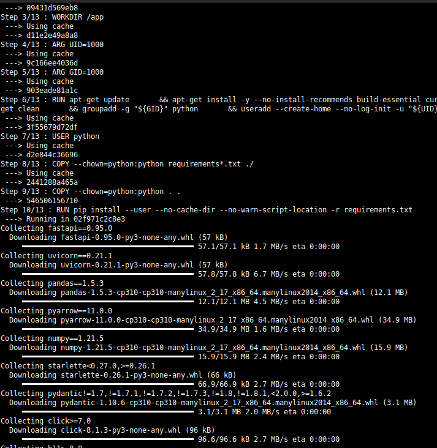
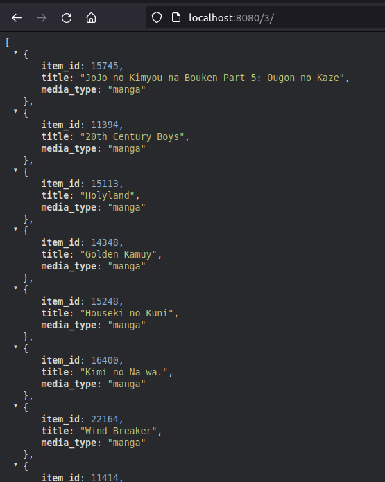
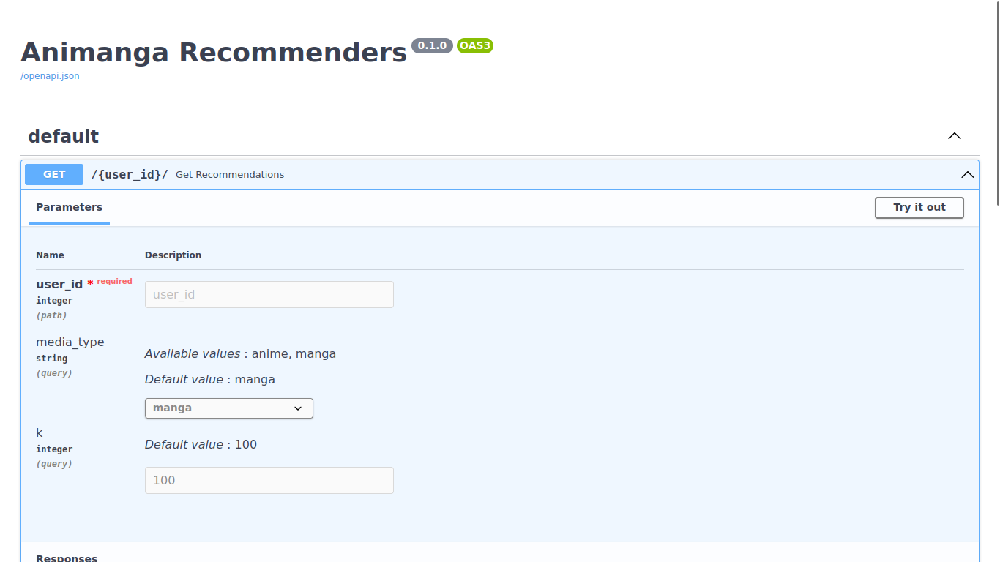
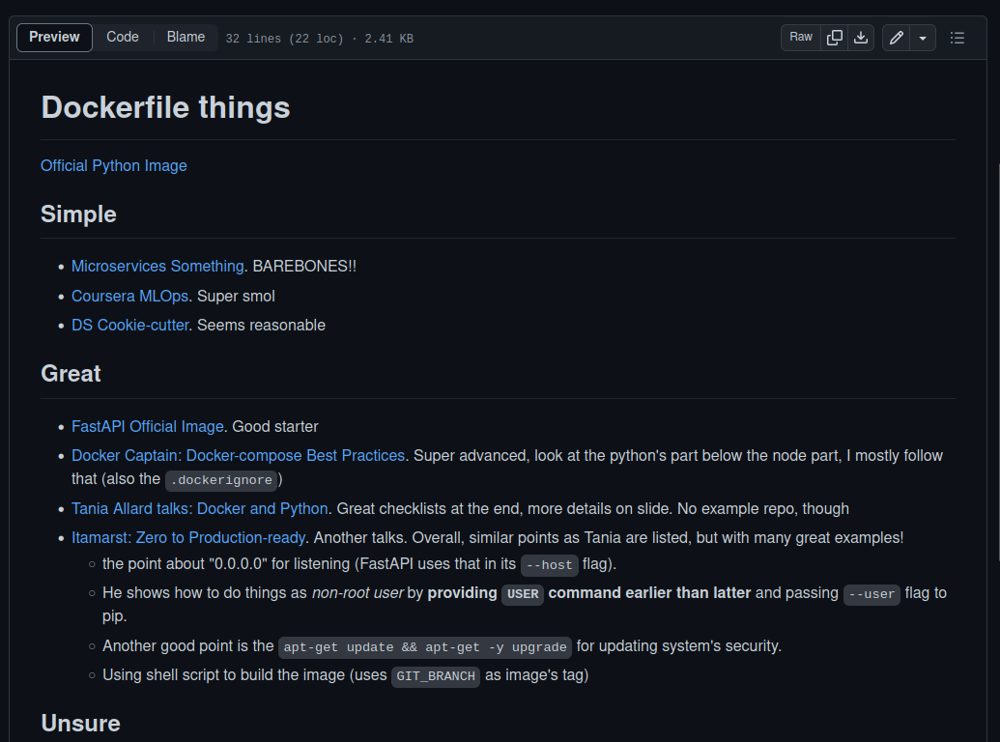

# Anime and Manga Recommendation System

This repository shows a simple deployment of an anime and manga recommendation system model using [FastAPI](https://fastapi.tiangolo.com/). It only uses a sample of data (4 records) for demonstration purposes.

The model is taken from my Bachelor thesis experiment result and [demo](./Demo_CDRS.ipynb). The demo is tidy and doesn't include the scraper, cleaning routine, and other tests (skip to the bottom of the notebook to see the recommendation in action!)

The experiments are published as paper and it can be accessed [here](https://ieeexplore.ieee.org/abstract/document/9946560)

## Installation

Use the `build-docker.sh` script to build the image

```bash
# execute the script to build the image
chmod +x ./build-docker.sh
./build-docker.sh

# running the image
docker run -d --name CONTAINER_NAME -p 8000:80 animanga-recommenders-fastapi:latest

# either access your browser and go to http://localhost:8000/USER_ID (integer between 0-3) or... (don't forget that last "/" ...)
curl -X GET http://localhost:8000/USER_ID/
```

## Some Pics

### Building the Image



### The API





### Notes



