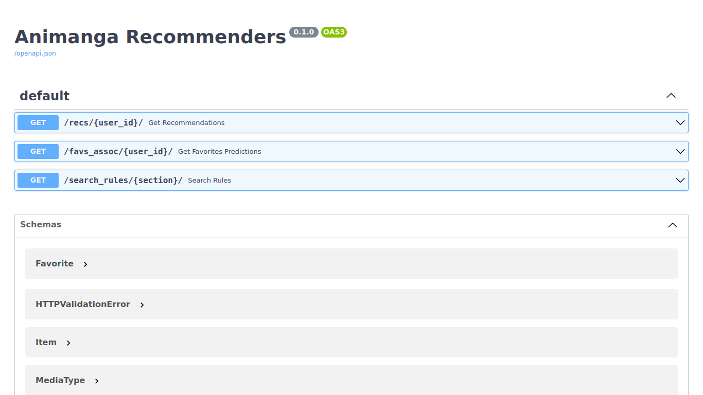
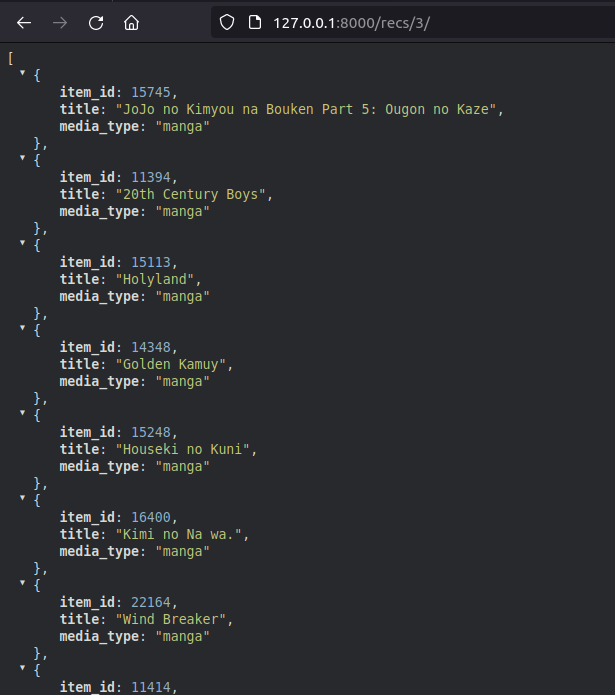

# Anime and Manga Recommendation System

This repository shows a simple deployment of an anime and manga recommendation system model and users' favorites association rules. Deployment is done using [FastAPI](https://fastapi.tiangolo.com/). It only uses a sample of data (4 records) for demonstration purposes.

The recommendation model is taken from my Bachelor thesis experiment result and [demo](./notebooks/Demo_CDRS.ipynb). The demo is tidy and doesn't include the scraper, cleaning routine, and other tests (skip to the bottom of the notebook to see the recommendation in action!)

The experiments are published as paper and it can be accessed [here](https://ieeexplore.ieee.org/abstract/document/9946560)

The association rules is a project I've done a while back that is related to this one, and I find it interesting so I include it here. The implementation is simple, mostly uses what's already given by Spark's [FP-Growth algorithm](https://spark.apache.org/docs/latest/ml-frequent-pattern-mining.html). The implementation can be found [here](./notebooks/Spark_Association_Rules.ipynb)

## Installation

Use the `build-docker.sh` script to build the image

```bash
# execute the script to build the image
chmod +x ./build-docker.sh
./build-docker.sh

# running the image
docker run -d --name CONTAINER_NAME -p 8000:80 animanga-recommenders-fastapi:latest

# either access your browser and go to http://localhost:8000/recs/USER_ID (integer between 0-3) or... (don't forget that last "/" ...)
curl -X GET http://localhost:8000/recs/USER_ID/
```

## Usage

There's 3 endpoint:

- `/recs/USER_ID` — used for anime and manga recommendation (matrix factorization)
- `/favs_assoc/USER_ID` — used for anime and manga recommendation (association rules)
- `/search_rules/SECTION/?query=QUERY` — sections is a value of either `[anime, manga, characters, people]` and query is the name/title of the section. this endpoint returns the rule for entered query

For trying out, visit `http://localhost:8000/docs`

## Some Pics

### The API






### Building the Image and Notes about Docker


### Association Rule Recs for Me & Training


